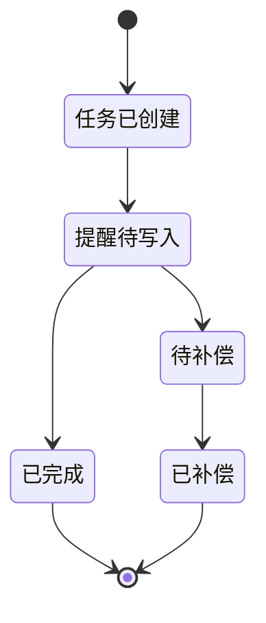

# 分布式事务设计

## 场景

当前选择“创建带提醒的任务”作为 Saga 探索场景：

1. Workspace Service 创建任务。
2. 如果任务带截止日期，则记录任务提醒 Saga。
3. 后续接入通知服务后，由后台 worker 读取 Saga 状态并写入提醒。
4. 提醒写入失败时执行补偿，删除提醒记录但保留任务本体。

## 已落地内容

- 新增 `task_sagas` 表。
- `CreateTask` 在任务带 `dueDate` 时记录一条 Saga 状态。
- Saga 记录包含任务 ID、用户 ID、Saga 类型、状态、当前步骤、补偿说明和下一次执行时间。

## 状态流转

## 后续接入点

- 增加通知服务。
- 增加 Saga worker。
- worker 按 `next_run_at` 拉取待执行 Saga。
- 正向步骤成功后标记完成。
- 失败超过阈值后执行补偿逻辑。
