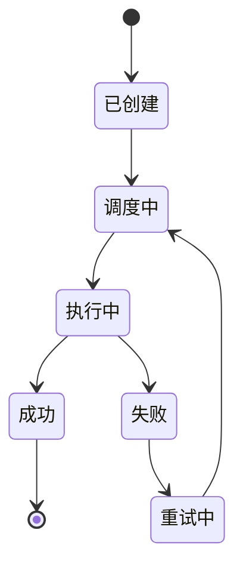

# 分布式任务调度系统设计

## 目标

构建可独立演进的分布式任务调度系统，用于定时任务、延迟任务、失败重试和任务分片。

## 核心模块

- 任务状态机：创建、调度中、执行中、成功、失败、重试中。
- 主节点选举：基于 etcd lease 和 watch 实现调度主节点。
- 任务分片：按任务 ID 哈希分片，避免多节点重复调度。
- 时间轮：多级时间轮承载高吞吐延迟触发。
- Cron 解析：支持标准 Cron 表达式。
- 重试策略：支持固定间隔、指数退避和最大次数。

## 状态流转

## 与 WorkPal 的关系

当前 WorkPal 的任务、日程、消息 outbox 和 Saga worker 都可以成为调度系统的消费场景。后续可先以 Workspace Service 的提醒任务作为试点。
