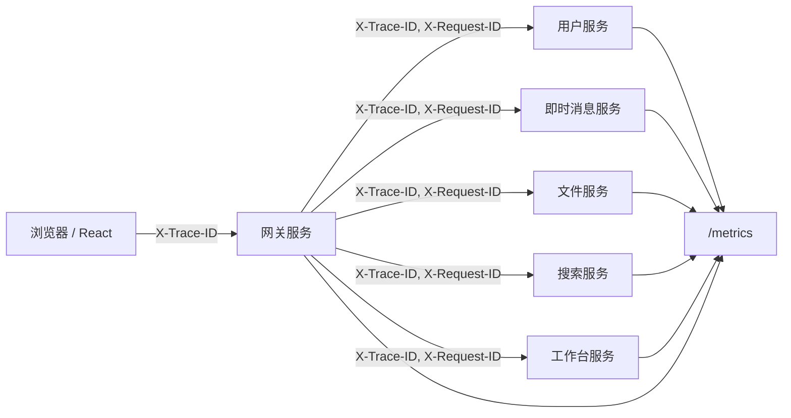

# WorkPal 可观测性设计

## 建设目标

WorkPal 由网关、用户、即时消息、文件、搜索、工作台等服务组成。第一阶段可观测性建设聚焦三件事：

1. 每个请求都有稳定的 `trace_id`，方便跨服务串联日志。
2. 后端访问日志统一输出 JSON，便于日志平台按字段检索。
3. 每个服务暴露 `/metrics`，让 Prometheus 采集请求量、错误率和延迟分布。

## 链路模型



## 链路标识规则

- 前端请求拦截器会为每个接口请求生成 W3C 风格 32 位 trace id，并写入 `X-Trace-ID` 和 `traceparent`。
- 后端公共中间件优先读取 `traceparent`，其次兼容 `X-Trace-ID` 和 `X-Request-ID`。
- 请求没有携带链路标识时，服务端会生成新的 UUID。
- 响应会同时返回 `X-Trace-ID` 和 `X-Request-ID`。
- 网关转发下游服务时会继续写入同一个 `traceparent`、`X-Trace-ID` 和 `X-Request-ID`。

## 结构化日志

后端服务通过 `platform.NewRouter` 自动启用 JSON 访问日志。关键字段如下：

| 字段 | 说明 |
|:---|:---|
| `service` | 当前服务名 |
| `trace_id` | 跨服务请求标识 |
| `user_id` | 认证后可用的用户 ID |
| `method` | HTTP 方法 |
| `path` | 请求路径 |
| `route` | Gin 路由模板或网关路由名 |
| `status` | HTTP 状态码 |
| `duration_ms` | 请求耗时 |
| `client_ip` | 客户端 IP |
| `upstream_service` | 网关转发到的下游服务 |

示例：

```json
{"time":"2026-05-05T10:20:30.000Z","level":"INFO","msg":"HTTP请求","service":"gateway","trace_id":"9d9a5d75-1d0e-4c86-9d7e-f5a2a8cbd1a4","method":"GET","path":"/api/v1/conversations","route":"im-conversations","status":200,"duration_ms":18,"client_ip":"127.0.0.1","upstream_service":"im-service"}
```

## 指标暴露

所有服务默认暴露 `/metrics`，包含 Go 运行时指标和 WorkPal HTTP 指标：

| 指标 | 类型 | 标签 | 说明 |
|:---|:---|:---|:---|
| `workpal_http_requests_total` | 计数器 | `service`, `method`, `route`, `status` | HTTP 请求总数 |
| `workpal_http_request_duration_seconds` | 直方图 | `service`, `method`, `route`, `status` | HTTP 延迟分布，可计算 P50/P95/P99 |
| `workpal_http_in_flight_requests` | 仪表盘 | `service`, `method` | 当前处理中请求数 |

推荐查询：

```promql
# 每秒请求数
sum by (service) (rate(workpal_http_requests_total[5m]))

# 错误率
sum by (service) (rate(workpal_http_requests_total{status=~"5.."}[5m]))
/
sum by (service) (rate(workpal_http_requests_total[5m]))

# P99 延迟
histogram_quantile(
  0.99,
  sum by (service, route, le) (rate(workpal_http_request_duration_seconds_bucket[5m]))
)
```

## 看板建议

服务概览看板：

- 各服务每秒请求数
- 各服务 4xx/5xx 错误率
- 各服务 P95/P99 延迟
- Go goroutine 数、GC 暂停、内存占用

接口明细看板：

- 按 `service` 和 `route` 展示请求量
- 按 `service` 和 `route` 展示 P50/P95/P99
- 慢接口排行
- 错误接口排行

## 本地验证

1. 启动任意后端服务。
2. 请求业务接口并指定链路标识：

```bash
curl -H "X-Trace-ID: demo-trace-001" http://localhost:8080/api/v1/conversations
```

3. 检查响应头是否包含同一个 `X-Trace-ID`。
4. 检查服务日志，按 `trace_id=demo-trace-001` 检索请求。
5. 访问 `/metrics`，确认存在 `workpal_http_requests_total`、`workpal_http_request_duration_seconds` 和 `workpal_http_in_flight_requests`。

## 后续增强

第一阶段已经建立链路标识、结构化日志和指标暴露，并在 Compose 中补充 Prometheus、Grafana、Jaeger。当前 Jaeger 已作为追踪后端随 Compose 启动，下一阶段可以把现有 `trace_id` 映射到标准 trace context，并由 OpenTelemetry SDK 将 span 导出到 Jaeger，用于查看网关到下游服务的完整调用瀑布图。

## 本地监控栈

```bash
docker compose -f docker/docker-compose.yaml up -d prometheus grafana jaeger
```

- Prometheus：`http://localhost:9090`
- Grafana：`http://localhost:3001`
- Jaeger：`http://localhost:16686`

Grafana 会自动加载中文看板：

- `docker/监控/grafana/dashboards/服务概览.json`
- `docker/监控/grafana/dashboards/接口明细.json`
