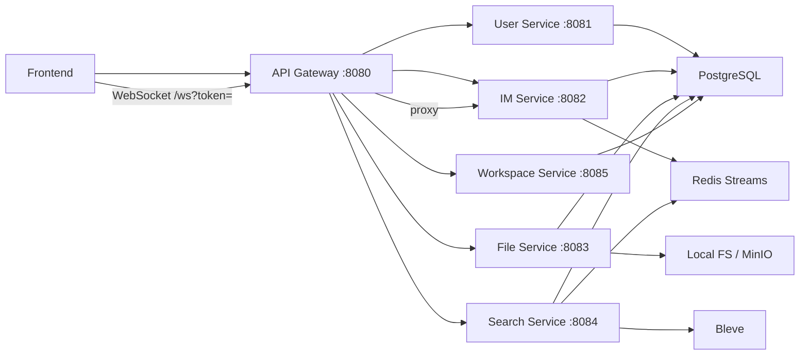

# WorkPal 后端微服务技术栈分析

> 更新时间：2026-04-29  
> 范围：本文只分析当前后端微服务部分。除技术名词、项目目录名、文件名、接口路径和代码外，正文尽量使用中文。

## 1. 后端整体定位

当前后端从原来的一体化 `cmd/server` 扩展为“网关 + 领域服务”的微服务形态。前端仍然只访问一个入口 `http://localhost:8080`，后端内部按业务边界拆成多个可独立启动的服务：

| 服务 | 入口文件 | 默认端口 | 主要职责 |
|---|---|---:|---|
| API Gateway | `backend/cmd/gateway/main.go` | `8080` | 统一入口、反向代理、按路径转发 |
| User Service | `backend/cmd/user-service/main.go` | `8081` | 登录、用户、部门、通讯录种子数据 |
| IM Service | `backend/cmd/im-service/main.go` | `8082` | 会话、消息、已读、WebSocket、消息事件发布 |
| File Service | `backend/cmd/file-service/main.go` | `8083` | 个人文件、群文件、存储适配 |
| Search Service | `backend/cmd/search-service/main.go` | `8084` | 搜索接口、Bleve 索引、消息事件消费 |
| Workspace Service | `backend/cmd/workspace-service/main.go` | `8085` | 任务和日程持久化 |
| All-in-one Server | `backend/cmd/server/main.go` | `8080` | 保留的一体化兼容启动方式 |

微服务拆分后的关键点是：用户、聊天、文件、搜索可以分别启动；前端 API 不需要知道这些端口，因为 Gateway 保持统一入口。

## 2. 技术栈总览

| 层次 | 技术 | 当前用途 |
|---|---|---|
| HTTP 框架 | Gin | 各服务提供 REST API、健康检查和指标端点 |
| 网关 | `net/http/httputil.ReverseProxy` | `gateway` 按路径反向代理到不同服务 |
| 数据库 | PostgreSQL | 用户、部门、会话、消息、文件元数据的事实源 |
| ORM | GORM | 模型迁移、仓储层查询、事务和软删除 |
| 鉴权 | JWT | 登录后签发 token，各服务通过中间件校验 |
| 消息队列 | Redis Streams | IM 写消息后发布事件，Search 异步更新索引 |
| 搜索 | Bleve | 进程内全文索引，服务于消息搜索 |
| 文件存储 | Local FS / MinIO | 通过 `FileStore` 接口切换本地和对象存储 |
| 实时通信 | WebSocket | IM Service 维护连接和会话消息推送 |
| 可观测性 | Prometheus | 每个服务暴露 `/metrics` |
| 配置 | Viper + YAML + 环境变量 | 统一加载端口、数据库、Redis、文件和搜索配置 |

## 3. 当前调用关系



当前是“共享数据库 + 服务拆分”的过渡形态。服务已经按领域拆开，`File Service` 和 `Search Service` 不再直接引用 `internal/im` 的 repo/service，而是通过 `IM Service` 的 internal HTTP API 查询会话权限。这种方式适合当前项目规模，后续如果继续演进，可以把 internal API 替换为事件投影表或独立权限服务。

## 4. 共享平台层

新增的 `backend/internal/platform` 用来消除每个服务入口中的重复启动代码，主要负责配置加载、数据库连接、Redis 连接、基础路由、健康检查和 HTTP 启动。

关键代码来自 `backend/internal/platform/runtime.go`：

```go
func LoadConfig() (*config.Config, error) {
	cfg, err := config.Load(ResolveConfigPath())
	if err != nil {
		return nil, err
	}
	if cfg.Server.JWTSecret == "" {
		return nil, fmt.Errorf("server.jwtSecret cannot be empty")
	}
	auth.SetSecret(cfg.Server.JWTSecret)
	return cfg, nil
}
```

这段代码把配置加载和 JWT 密钥初始化集中到一个地方，避免每个服务重复写一遍。

数据库连接同样在平台层统一处理：

```go
func OpenDB(cfg *config.Config) (*gorm.DB, *sql.DB, error) {
	db, err := gorm.Open(postgres.Open(cfg.Database.DSN()), &gorm.Config{
		Logger: logger.Default.LogMode(logger.Info),
	})
	if err != nil {
		return nil, nil, err
	}

	sqlDB, err := db.DB()
	if err != nil {
		return nil, nil, err
	}
	sqlDB.SetMaxOpenConns(cfg.Database.MaxOpenConns)
	sqlDB.SetMaxIdleConns(cfg.Database.MaxIdleConns)
	return db, sqlDB, nil
}
```

每个服务都通过 `platform.NewRouter` 获得统一的 Gin 基础能力：

```go
func NewRouter(cfg *config.Config, serviceName string) *gin.Engine {
	if cfg.Server.Mode == "release" {
		gin.SetMode(gin.ReleaseMode)
	}

	r := gin.New()
	r.Use(gin.Logger())
	r.Use(gin.Recovery())
	r.Use(middleware.CORS())

	r.GET("/", func(c *gin.Context) {
		c.JSON(http.StatusOK, gin.H{
			"name":    "WorkPal",
			"service": serviceName,
			"version": Version,
			"status":  "running",
		})
	})
	r.GET("/metrics", gin.WrapH(promhttp.Handler()))
	return r
}
```

这说明所有微服务默认都有：

- `GET /` 服务信息
- `GET /metrics` Prometheus 指标
- Gin 日志和恢复中间件
- CORS 中间件

## 5. 配置模型

配置结构在 `backend/configs/config.go` 中新增了 `ServicesConfig`：

```go
type ServicesConfig struct {
	GatewayPort int
	UserPort    int
	IMPort      int
	FilePort    int
	SearchPort  int
	UserURL     string
	IMURL       string
	FileURL     string
	SearchURL   string
}
```

样例配置在 `backend/configs/config.example.yaml` 中：

```yaml
services:
  gatewayPort: 8080
  userPort: 8081
  imPort: 8082
  filePort: 8083
  searchPort: 8084
  userURL: "http://localhost:8081"
  imURL: "http://localhost:8082"
  fileURL: "http://localhost:8083"
  searchURL: "http://localhost:8084"
```

端口和上游 URL 都放进配置，Gateway 不需要在代码里写死服务地址。后续如果部署到 Docker Compose、Kubernetes 或多台机器，只需要调整配置。

## 6. API Gateway

`API Gateway` 的入口是 `backend/cmd/gateway/main.go`。它使用标准库的 `httputil.NewSingleHostReverseProxy`，按路径把请求转发到对应服务。

关键结构：

```go
type proxySet struct {
	user   *httputil.ReverseProxy
	im     *httputil.ReverseProxy
	file   *httputil.ReverseProxy
	search *httputil.ReverseProxy
}
```

Gateway 初始化所有上游代理：

```go
func newProxySet(cfg *config.Config) (*proxySet, error) {
	userProxy, err := newReverseProxy(cfg.Services.UserURL)
	if err != nil {
		return nil, err
	}
	imProxy, err := newReverseProxy(cfg.Services.IMURL)
	if err != nil {
		return nil, err
	}
	fileProxy, err := newReverseProxy(cfg.Services.FileURL)
	if err != nil {
		return nil, err
	}
	searchProxy, err := newReverseProxy(cfg.Services.SearchURL)
	if err != nil {
		return nil, err
	}
	return &proxySet{
		user:   userProxy,
		im:     imProxy,
		file:   fileProxy,
		search: searchProxy,
	}, nil
}
```

核心转发逻辑是 `match`：

```go
func (p *proxySet) match(path string) *httputil.ReverseProxy {
	switch {
	case path == "/ws":
		return p.im
	case strings.HasPrefix(path, "/api/v1/auth"):
		return p.user
	case strings.HasPrefix(path, "/api/v1/users"):
		return p.user
	case strings.HasPrefix(path, "/api/v1/departments"):
		return p.user
	case strings.HasPrefix(path, "/api/v1/files"):
		return p.file
	case strings.HasPrefix(path, "/api/v1/conversations/") && strings.HasSuffix(path, "/files"):
		return p.file
	case strings.HasPrefix(path, "/api/v1/search"):
		return p.search
	case strings.HasPrefix(path, "/api/v1/tasks"):
		return p.workspace
	case strings.HasPrefix(path, "/api/v1/schedule"):
		return p.workspace
	case strings.HasPrefix(path, "/api/v1/conversations"):
		return p.im
	case strings.HasPrefix(path, "/api/v1/messages"):
		return p.im
	default:
		return nil
	}
}
```

这里有两个重要设计：

1. `/ws` 被转发到 `IM Service`，因此前端仍然连接 Gateway。
2. `/api/v1/conversations/:id/files` 被转发到 `File Service`，因为群文件属于文件领域，但需要会话上下文。

请求入口放在 `NoRoute` 中：

```go
r.NoRoute(func(c *gin.Context) {
	proxy := proxies.match(c.Request.URL.Path)
	if proxy == nil {
		c.JSON(http.StatusNotFound, gin.H{"error": "route not found"})
		return
	}
	proxy.ServeHTTP(c.Writer, c.Request)
})
```

这种方式简单直接，适合当前项目。后续如果需要限流、统一鉴权、请求追踪，可以继续在 Gateway 层增强。

## 7. User Service

`User Service` 入口是 `backend/cmd/user-service/main.go`，负责用户和组织数据。

启动逻辑：

```go
if err := db.AutoMigrate(&model.User{}, &model.Department{}, &model.Employee{}); err != nil {
	log.Fatalf("migrate user service schema: %v", err)
}
```

这表示该服务负责迁移：

- `users`
- `departments`
- `employees`

开发环境下会自动保证种子账号存在：

```go
userRepoInst := userRepo.NewUserRepo(db)
if cfg.Server.Mode != "release" {
	if err := platform.EnsureDevelopmentUsers(context.Background(), db, userRepoInst); err != nil {
		log.Fatalf("seed development users: %v", err)
	}
	log.Printf("development users ensured (%d accounts)", platform.DevelopmentUserCount())
}
```

然后组装业务层和 Handler：

```go
authSvc := userService.NewAuthService(userRepoInst, cfg.Server.JWTExpiryHours)
userSvc := userService.NewUserService(userRepoInst)
userHdlr := userHandler.NewUserHandler(userSvc, authSvc)

r := platform.NewRouter(cfg, "user-service")
platform.RegisterHealth(r, sqlDB, nil)
apiV1 := r.Group("/api/v1")
userHdlr.RegisterRoutes(apiV1)
```

从实现方式看，它仍然复用原有 `internal/user` 分层：

```text
handler -> service -> repo -> model
```

对应目录：

- `backend/internal/user/handler`
- `backend/internal/user/service`
- `backend/internal/user/repo`
- `backend/internal/user/model`

## 8. IM Service

`IM Service` 入口是 `backend/cmd/im-service/main.go`，负责会话、消息、已读、WebSocket 和消息事件发布。

它连接 PostgreSQL 和 Redis：

```go
db, sqlDB, err := platform.OpenDB(cfg)
if err != nil {
	log.Fatalf("open database: %v", err)
}
defer sqlDB.Close()

redisClient, err := platform.OpenRedis(cfg)
if err != nil {
	log.Fatalf("open redis: %v", err)
}
defer redisClient.Close()
```

Redis 有两个用途：

1. `platform.InitCache(cfg)` 给在线状态等缓存逻辑使用。
2. `msgqueue.NewRedisStreams` 给消息事件发布使用。

关键代码：

```go
if err := platform.InitCache(cfg); err != nil {
	log.Fatalf("init cache: %v", err)
}
msgqueue.Init(msgqueue.NewRedisStreams(redisClient, cfg.Redis.StreamsKey, "workpal-im"))
```

IM 服务负责迁移聊天相关表：

```go
if err := db.AutoMigrate(
	&model.Conversation{},
	&model.ConversationMember{},
	&model.Message{},
	&model.MessageRead{},
); err != nil {
	log.Fatalf("migrate im service schema: %v", err)
}
```

业务对象组装：

```go
convRepo := repo.NewConversationRepo(db)
msgRepo := repo.NewMessageRepo(db)
convSvc := service.NewConversationService(convRepo)
msgSvc := service.NewMessageService(msgRepo)
_ = service.NewPresenceService()
hub := imWS.InitHub()

convHandler := handler.NewConversationHandler(convSvc)
msgHandler := handler.NewMessageHandler(msgSvc, convSvc, hub, nil)
wsHandler := handler.NewWebSocketHandler(hub, convSvc)
```

这里的 `hub := imWS.InitHub()` 是 WebSocket 长连接管理中心。当前 Hub 仍是单进程内存结构，因此单个 `IM Service` 实例内可以直接广播；如果未来部署多个 `IM Service` 实例，还需要把跨实例广播接入 Redis Pub/Sub 或 Redis Streams。

WebSocket 鉴权逻辑：

```go
func registerWebSocket(r *gin.Engine, wsHandler *handler.WebSocketHandler) {
	r.GET("/ws", func(c *gin.Context) {
		var tokenStr string
		if t := c.Query("token"); t != "" {
			tokenStr = t
		} else if authHeader := c.GetHeader("Authorization"); authHeader != "" {
			tokenStr = authHeader
			if len(authHeader) > 7 && authHeader[:7] == "Bearer " {
				tokenStr = authHeader[7:]
			}
		} else {
			c.JSON(http.StatusUnauthorized, gin.H{"error": "missing token"})
			return
		}

		claims, err := auth.ParseToken(tokenStr)
		if err != nil {
			c.JSON(http.StatusUnauthorized, gin.H{"error": "invalid token"})
			return
		}
		c.Set("userID", claims.UserID)
		wsHandler.Handle(c)
	})
}
```

前端仍然连接 `/ws?token=...`，只是请求先经过 Gateway，再转发到 `IM Service`。

## 9. File Service

`File Service` 入口是 `backend/cmd/file-service/main.go`，负责文件接口和存储适配。

它迁移自己的文件表：

```go
if err := db.AutoMigrate(&fileModel.File{}); err != nil {
	log.Fatalf("migrate file service schema: %v", err)
}
```

然后按配置选择存储实现：

```go
func newFileStore(cfg *config.Config) fileSvc.FileStore {
	if cfg.File.StoreType == "minio" {
		store, err := fileSvc.NewMinIOFileStore(
			cfg.File.MinIO.Endpoint,
			cfg.File.MinIO.AccessKey,
			cfg.File.MinIO.SecretKey,
			cfg.File.MinIO.Bucket,
			cfg.File.MinIO.UseSSL,
		)
		if err == nil {
			log.Println("file storage initialized in MinIO mode")
			return store
		}
		log.Printf("minio initialization failed, falling back to local storage: %v", err)
	}

	log.Println("file storage initialized in local mode")
	return fileSvc.NewLocalFileStore(cfg.File.LocalBaseDir)
}
```

真正的存储抽象在 `backend/internal/file/service/file_svc.go`：

```go
type FileStore interface {
	Upload(ctx context.Context, key string, r io.Reader, size int64, contentType string) error
	Download(ctx context.Context, key string) (io.ReadCloser, error)
	Delete(ctx context.Context, key string) error
	GetURL(ctx context.Context, key string) (string, error)
}
```

当前有两个实现：

- `LocalFileStore`：写入本地目录。
- `MinIOFileStore`：写入对象存储。

文件上传的核心逻辑：

```go
func (s *FileService) Upload(ctx context.Context, userID int64, convID int64, fileHeader *multipart.FileHeader) (*model.File, error) {
	if int(fileHeader.Size) > s.maxSizeMB*1024*1024 {
		return nil, fmt.Errorf("文件大小超过限制 (%dMB)", s.maxSizeMB)
	}

	src, err := fileHeader.Open()
	if err != nil {
		return nil, err
	}
	defer src.Close()

	ext := filepath.Ext(fileHeader.Filename)
	key := fmt.Sprintf("%d/%d/%s%s", userID, convID, uuid.New().String(), ext)

	if err := s.store.Upload(ctx, key, src, fileHeader.Size, fileHeader.Header.Get("Content-Type")); err != nil {
		return nil, err
	}

	file := &model.File{
		UserID:      userID,
		ConvID:      convID,
		Name:        fileHeader.Filename,
		Key:         key,
		Size:        fileHeader.Size,
		ContentType: fileHeader.Header.Get("Content-Type"),
		MimeType:    fileHeader.Header.Get("Content-Type"),
		CreatedAt:   time.Now(),
	}
	if err := s.repo.Create(ctx, file); err != nil {
		return nil, err
	}

	return file, nil
}
```

注意：`File Service` 当前通过 `IMClient` 调用 `IM Service` internal API，用于校验群文件访问者是不是会话成员：

```go
convSvc := clients.NewIMClient(cfg.Services.IMURL)
fileHdlr := fileHandler.NewFileHandler(fileService, convSvc)
```

这说明文件权限仍依赖会话成员关系，但依赖方向已经从“直接引用 IM 内部 repo/service”改成“服务间 HTTP 查询”。

## 10. Search Service

`Search Service` 入口是 `backend/cmd/search-service/main.go`，负责搜索 API 和消息索引事件消费。

启动时打开 Bleve 索引：

```go
searchService, err := searchSvc.NewSearchService(cfg.Search.Bleve.IndexPath)
if err != nil {
	log.Fatalf("open search index: %v", err)
}
defer searchService.Close()
```

然后初始化 Redis Streams 消费者：

```go
queue := msgqueue.NewRedisStreams(redisClient, cfg.Redis.StreamsKey, "workpal-search")
msgqueue.Init(queue)
subscribeMessageEvents(queue, searchService)
```

消息写入事件的消费逻辑：

```go
if err := queue.Subscribe(events.TopicMessageUpserted, func(data []byte) {
	var msg imModel.Message
	if err := json.Unmarshal(data, &msg); err != nil {
		log.Printf("decode message upsert event: %v", err)
		return
	}
	if err := searchService.IndexMessage(&msg); err != nil {
		log.Printf("index message %d: %v", msg.ID, err)
	}
}); err != nil {
	log.Printf("subscribe message upsert events: %v", err)
}
```

消息删除事件的消费逻辑：

```go
if err := queue.Subscribe(events.TopicMessageDeleted, func(data []byte) {
	var event events.MessageDeletedEvent
	if err := json.Unmarshal(data, &event); err != nil {
		log.Printf("decode message delete event: %v", err)
		return
	}
	if err := searchService.DeleteMessage(event.ID); err != nil {
		log.Printf("delete message %d from search index: %v", event.ID, err)
	}
}); err != nil {
	log.Printf("subscribe message delete events: %v", err)
}
```

Search Service 也通过 `IMClient` 查询当前用户可访问的会话范围：

```go
convSvc := clients.NewIMClient(cfg.Services.IMURL)
searchHdlr := searchHandler.NewSearchHandler(searchService, convSvc)
```

原因是消息搜索需要按当前用户可见的会话范围做权限过滤。当前实现已经由 `IM Service` 提供 internal API；后续如果要继续强化服务自治，可以由事件同步一份搜索服务自己的权限投影表。

## 11. Workspace Service

`Workspace Service` 入口是 `backend/cmd/workspace-service/main.go`，负责把过去前端本地演示状态中的任务和日程持久化到 PostgreSQL。

它迁移两张表：

```go
if err := db.AutoMigrate(&workspaceModel.Task{}, &workspaceModel.ScheduleEvent{}); err != nil {
	log.Fatalf("migrate workspace service schema: %v", err)
}
```

注册的路由包括：

```go
auth.GET("/tasks", h.ListTasks)
auth.POST("/tasks", h.CreateTask)
auth.PUT("/tasks/:id/status", h.UpdateTaskStatus)
auth.POST("/tasks/:id/share", h.ShareTask)
auth.DELETE("/tasks/:id", h.DeleteTask)
auth.GET("/schedule", h.ListEvents)
auth.POST("/schedule", h.CreateEvent)
auth.POST("/schedule/:id/share", h.ShareEvent)
auth.DELETE("/schedule/:id", h.DeleteEvent)
```

前端 `WorkspacePage` 现在会从 `workpalApi.listTasks()` 和 `workpalApi.listSchedule()` 加载任务和日程，创建、状态更新、分享、删除都会调用后端 API。这样任务和日程从“刷新即丢失”的本地状态变成了真实后端数据。

## 12. Redis Streams 事件链路

消息事件定义在 `backend/internal/events/messages.go`：

```go
const (
	TopicMessageUpserted = "message.upserted"
	TopicMessageDeleted  = "message.deleted"
)

type MessageDeletedEvent struct {
	ID int64 `json:"id"`
}
```

发布消息写入或更新事件：

```go
func PublishMessageUpserted(ctx context.Context, msg *model.Message) error {
	if msg == nil {
		return nil
	}
	data, err := json.Marshal(msg)
	if err != nil {
		return err
	}
	return msgqueue.Publish(ctx, TopicMessageUpserted, data)
}
```

发布删除事件：

```go
func PublishMessageDeleted(ctx context.Context, id int64) error {
	data, err := json.Marshal(MessageDeletedEvent{ID: id})
	if err != nil {
		return err
	}
	return msgqueue.Publish(ctx, TopicMessageDeleted, data)
}
```

IM 的消息 Handler 在写库和广播后发布事件：

```go
if h.searchSvc != nil {
	_ = h.searchSvc.IndexMessage(msg)
}
_ = events.PublishMessageUpserted(c.Request.Context(), msg)
```

删除消息时发布删除事件：

```go
if h.searchSvc != nil {
	_ = h.searchSvc.DeleteMessage(msgID)
}
_ = events.PublishMessageDeleted(c.Request.Context(), msgID)
```

这里保留了 `h.searchSvc != nil` 的兼容逻辑，因为一体化 `cmd/server` 仍可能直接注入搜索服务；微服务模式下 `IM Service` 传入的是 `nil`，只负责发布事件。

## 13. Redis Streams 实现

消息队列接口在 `backend/pkg/msgqueue/msgqueue.go`：

```go
type Interface interface {
	Publish(ctx context.Context, topic string, msg []byte) error
	Subscribe(topic string, handler func([]byte)) error
	Close() error
}
```

Redis Streams 的发布逻辑在 `backend/pkg/msgqueue/redis_streams.go`：

```go
func (r *RedisStreams) Publish(ctx context.Context, topic string, msg []byte) error {
	return r.client.XAdd(ctx, &redis.XAddArgs{
		Stream: r.key,
		Values: map[string]interface{}{
			"topic": topic,
			"data":  string(msg),
			"time":  time.Now().UnixMilli(),
		},
	}).Err()
}
```

订阅时会创建消费者组：

```go
func (r *RedisStreams) Subscribe(topic string, handler func([]byte)) error {
	r.client.XGroupCreateMkStream(context.Background(), r.key, r.group, "0")

	go r.consume(topic, handler)
	return nil
}
```

消费逻辑使用 `XReadGroup`：

```go
streams, err := r.client.XReadGroup(ctx, &redis.XReadGroupArgs{
	Group:    r.group,
	Consumer: fmt.Sprintf("consumer-%d", time.Now().UnixNano()),
	Streams:  []string{r.key, ">"},
	Count:    10,
	Block:    time.Second,
}).Result()
```

消费后会根据 `topic` 过滤，再调用 handler：

```go
if topicVal == topic {
	dataStr, ok := msg.Values["data"].(string)
	if !ok {
		continue
	}
	data := []byte(dataStr)
	go handler(data)
}
r.client.XAck(ctx, r.key, r.group, msg.ID)
```

当前实现可以满足“IM 写消息”和“Search 更新索引”的解耦需求。需要注意的是，当前消费者名每次读取都会变化，适合演示和轻量使用；如果要上生产，应改成稳定 consumer 名，并补充 pending 消息重试策略、死信队列和幂等处理。

## 13. 微服务启动命令

`backend/Makefile` 已增加每个服务的启动命令：

```makefile
run-gateway:
	$(GOCMD) run ./cmd/gateway

run-user:
	$(GOCMD) run ./cmd/user-service

run-im:
	$(GOCMD) run ./cmd/im-service

run-file:
	$(GOCMD) run ./cmd/file-service

run-search:
	$(GOCMD) run ./cmd/search-service
```

构建命令：

```makefile
build-services:
	mkdir -p bin
	CGO_ENABLED=0 $(GOBUILD) -o bin/gateway ./cmd/gateway
	CGO_ENABLED=0 $(GOBUILD) -o bin/user-service ./cmd/user-service
	CGO_ENABLED=0 $(GOBUILD) -o bin/im-service ./cmd/im-service
	CGO_ENABLED=0 $(GOBUILD) -o bin/file-service ./cmd/file-service
	CGO_ENABLED=0 $(GOBUILD) -o bin/search-service ./cmd/search-service
```

推荐本地启动顺序：

1. `docker compose -f docker/docker-compose.yaml up -d`
2. `go run ./cmd/user-service`
3. `go run ./cmd/im-service`
4. `go run ./cmd/file-service`
5. `go run ./cmd/search-service`
6. `go run ./cmd/gateway`
7. `frontend` 继续访问 `http://localhost:8080`

## 14. 当前微服务拆分的优点

### 14.1 前端入口稳定

前端不需要关心服务拆分，仍然访问：

```text
/api/*
/ws
```

所有内部服务地址变化都由 Gateway 配置处理。

### 14.2 领域边界更清楚

各服务入口只组装自己需要的依赖：

- `User Service` 不依赖 Redis。
- `IM Service` 依赖 PostgreSQL、Redis、WebSocket Hub。
- `File Service` 依赖 PostgreSQL、FileStore 和 `IM Service` internal API。
- `Search Service` 依赖 Redis Streams、Bleve 和 `IM Service` internal API。
- `Workspace Service` 依赖 PostgreSQL。

### 14.3 搜索索引异步化

消息发送不再强依赖搜索索引同步完成。IM 写库后发布事件，Search 自己消费事件。这样搜索服务短暂失败时，消息发送链路仍可以成功。

### 14.4 一体化模式保留

`backend/cmd/server/main.go` 没有删除，仍适合快速调试和对比。微服务模式适合学习拆分边界；一体化模式适合简单启动。

## 15. 当前限制和后续演进方向

### 15.1 共享数据库仍然存在

当前所有服务仍然连接同一个 PostgreSQL。严格微服务通常强调每个服务拥有自己的数据库，但这会显著增加复杂度。当前项目采取的是学习项目中更稳妥的过渡方案。

后续可以演进为：

- User Service 拥有用户库。
- IM Service 拥有会话和消息库。
- File Service 拥有文件元数据库。
- Search Service 只保留索引和权限投影。

### 15.2 跨服务权限仍是直接查表

`File Service` 和 `Search Service` 为了判断会话成员关系，会调用 `IM Service` internal API。后续如果要进一步减少同步服务调用，可以改成：

- 由 IM Service 发布会话成员事件。
- File/Search 维护自己的权限投影表。

### 15.3 WebSocket Hub 仍是单实例内存结构

当前 `IM Service` 的 Hub 只管理本进程内连接。如果部署多个 `IM Service`，同一会话的用户可能连到不同实例，此时需要跨实例广播。

可选方向：

- Redis Pub/Sub：适合在线消息广播。
- Redis Streams：适合需要可靠消费的消息流。
- NATS：更适合服务间事件总线。

### 15.4 Redis Streams 消费者需要生产级增强

当前 Redis Streams 已补充稳定 consumer 名、pending 消息认领、重试上限和 dead-letter stream。后续生产级增强重点包括：

- 更细的事件幂等策略。
- 消费延迟和失败指标。
- dead-letter 后台修复工具。
- 按 topic 拆分 stream 或消费者组。

## 16. 学习阅读顺序

建议按下面顺序阅读代码：

1. `backend/configs/config.go`：理解服务配置如何进入程序。
2. `backend/internal/platform/runtime.go`：理解每个服务如何共享启动逻辑。
3. `backend/cmd/gateway/main.go`：理解统一入口如何转发。
4. `backend/cmd/user-service/main.go`：理解最简单的领域服务启动方式。
5. `backend/cmd/im-service/main.go`：理解 WebSocket、Redis 和消息事件。
6. `backend/internal/events/messages.go`：理解事件格式。
7. `backend/pkg/msgqueue/redis_streams.go`：理解 Redis Streams 发布和订阅。
8. `backend/cmd/search-service/main.go`：理解事件消费者如何更新 Bleve。
9. `backend/cmd/file-service/main.go`：理解文件服务和存储抽象。
10. `backend/Makefile`：理解本地运行和构建命令。

## 17. 总结

当前 WorkPal 后端微服务化的核心思路是：用 Gateway 保持前端入口稳定，用独立 `cmd/*-service` 切分领域服务，用 Redis Streams 解耦 IM 写消息和 Search 建索引，用 `platform` 包复用服务启动基础设施。它还不是完全独立数据库的严格微服务，但已经具备微服务学习中最重要的几个概念：服务边界、反向代理、异步事件、独立启动、共享基础设施和渐进式演进路径。
