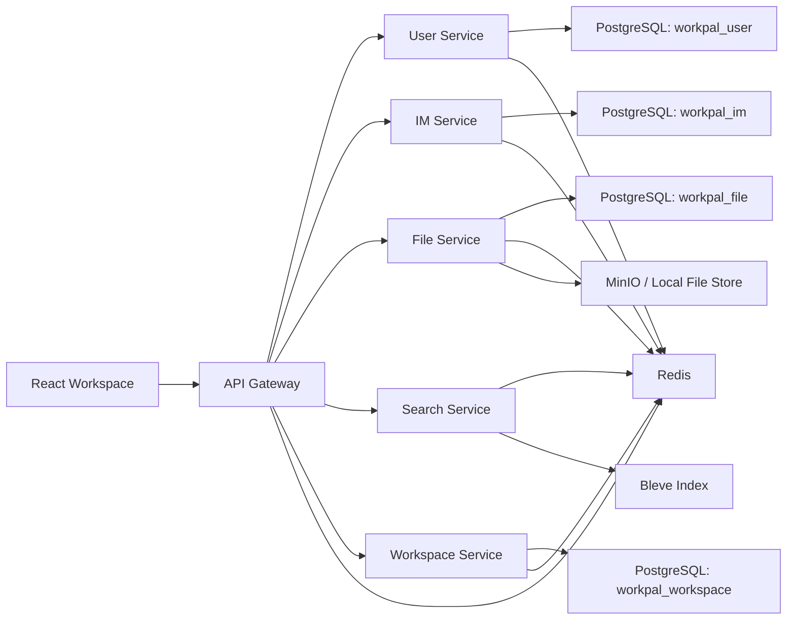

# WorkPal 架构设计

## 1. 目标

WorkPal 的目标不是做一个只有聊天功能的演示页，而是做一个适合学习微服务拆分、入口治理、实时协作和前后端边界的办公协作平台样本。

## 2. 总体结构

## 3. 服务划分

| 服务 | 说明 | 数据边界 |
| --- | --- | --- |
| Gateway | 前端唯一入口，负责转发和治理 | 无状态 |
| User Service | 登录、用户、部门、员工档案 | `workpal_user` |
| IM Service | 会话、消息、群公告、WebSocket、消息 outbox | `workpal_im` |
| File Service | 文件上传、删除、分享、群文件 | `workpal_file` |
| Search Service | 消息索引和搜索 | Bleve |
| Workspace Service | 任务、日程 | `workpal_workspace` |

## 4. Gateway 设计

Gateway 当前包含四层职责：

1. 路由目录
   由 `routeSpec` 和 `buildRouteSpecs` 显式声明
2. 服务目录
   由 `upstreamService` 描述下游服务元数据，并通过 `/gateway/services` 暴露
3. 入口治理
   包括限流、超时、重试、熔断
4. 运行可观测面
   包括请求 ID、路由信息、服务信息、健康检查

### 暴露接口

- `GET /health/live`
- `GET /health/ready`
- `GET /health`
- `GET /gateway/routes`
- `GET /gateway/services`

### 入口治理策略

- 限流：按客户端 IP 的内存限流
- 超时：按服务定义不同的超时
- 重试：仅对 `GET / HEAD / OPTIONS` 开启
- 熔断：按服务维度维护 `closed / open / half_open`

## 5. 服务注册发现

这是当前版本最重要的基础设施增强之一。

### 设计目标

- 让服务目录不再只存在于配置文件
- 让 Gateway 能看到 Redis 中的实例数据
- 保留静态配置回退，避免本地学习环境过重

### 实现方式

每个服务启动后：

1. 根据自身配置确定 `base_url`
2. 把实例信息注册到 Redis
3. 定时刷新 TTL
4. 进程退出时尝试注销

Gateway 转发请求时：

1. 优先从 Redis 获取当前服务实例
2. 如果有实例，则按轮转选择
3. 如果没有实例或 Redis 不可用，则回退到静态配置 URL

### 结果

`/gateway/services` 现在会展示：

- 当前服务的 `discovery_mode`
- 已发现实例数量
- 实例基础地址与健康地址
- 超时、重试、熔断状态

## 6. IM 跨实例实时设计

### 原问题

早期的 WebSocket Hub 只能在单实例内工作：

- 本机连接只知道本机客户端
- 多个 IM 实例之间不会共享实时事件

### 当前方案

引入 `ClusterBroadcaster`，使用 Redis Pub/Sub 做跨实例扇出。

### 用户定向消息

聊天消息发送后：

1. IM Service 完成消息持久化
2. Handler 获取会话成员列表
3. 本机实例先给本机在线成员投递
4. 再把事件发到 Redis Pub/Sub
5. 其他 IM 实例订阅后，把消息继续推给本机在线成员

### 房间广播消息

已读、已读全部等房间事件：

1. Hub 先做本机房间广播
2. 再通过 cluster broadcaster 发到 Redis
3. 其他实例把事件广播给本机已加入该房间的客户端

## 7. IM 到 Search 的异步索引链路

这条链路已经从“请求线程里顺手发事件”升级为更可靠的 outbox 模式。

### 当前流程

1. IM Service 写入消息或修改消息
2. 在同一事务里写入 `message_outbox`
3. Outbox worker 扫描待投递事件
4. 把事件发布到 Redis Streams
5. Search Service 订阅消息新增与删除事件
6. Bleve 更新索引

### 这样做的价值

- 业务写库与事件落地在同一事务中
- Redis 短暂抖动时不会直接丢失索引更新事件
- 更适合学习最终一致性和补偿投递

## 8. 前端数据边界

前端当前采用以下边界：

- 用户、通讯录、任务、日程、文件、聊天数据来自后端
- 登录页保留预置账号信息，便于验收
- 文件主列表不再混入前端写死的演示文档

这意味着前端工作台已经更接近真实产品，而不再是“带假数据的展示页”。

## 9. 当前架构的优势

- 入口层职责清晰
- 服务边界明确
- Redis 被用作多种基础设施能力
- 实时链路与异步链路都有较高学习价值
- 本地运行成本仍然可控

## 10. 当前架构仍然保留的不足

- 还没有独立配置中心
- 还没有完整链路追踪
- 还没有正式 migration 体系
- 服务发现仍是轻量 Redis 方案，不是完整注册中心

这些也是后续继续演进时最自然的方向。
