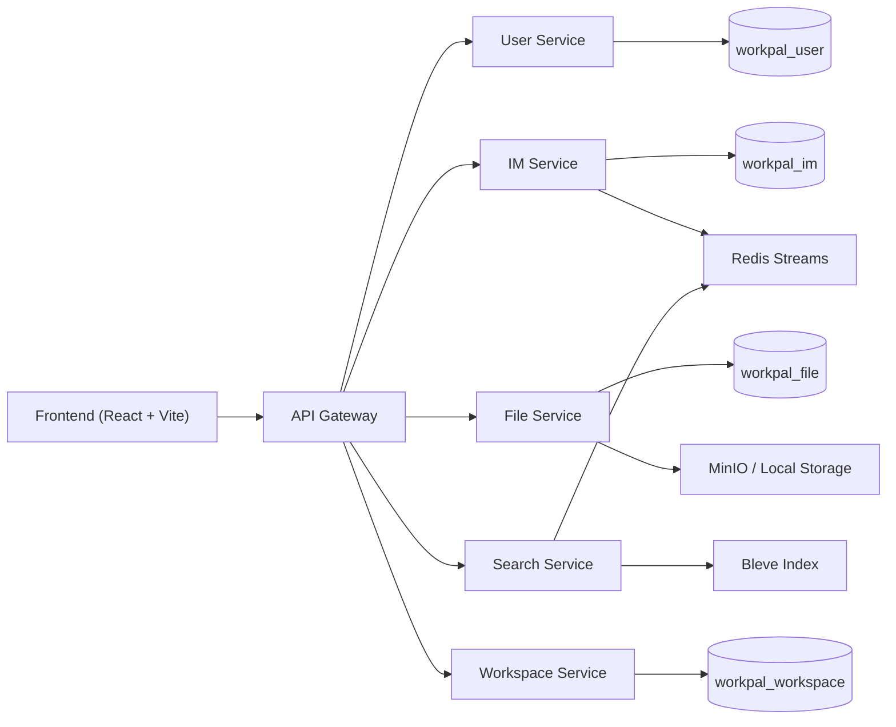

# WorkPal 架构设计

本文档描述当前仓库代码已经实现的架构，而不是未来设想。

## 1. 系统目标

WorkPal 当前定位为办公协作平台示例项目，覆盖以下核心场景：

- 登录与身份验证
- 通讯录与组织信息
- 私聊与群聊
- 群公告与群文件
- 任务与日程
- 文件上传与分享
- 消息搜索

## 2. 架构总览



## 3. 服务划分

### 3.1 API Gateway

职责：

- 前端唯一入口
- 按路径转发到对应服务
- 请求 ID 注入
- 简单限流
- 聚合健康检查

当前转发表：

| 路径 | 目标服务 |
| --- | --- |
| `/api/v1/auth/*` | User Service |
| `/api/v1/users*` | User Service |
| `/api/v1/departments*` | User Service |
| `/api/v1/conversations*` | IM Service |
| `/api/v1/messages*` | IM Service |
| `/ws` | IM Service |
| `/api/v1/files*` | File Service |
| `/api/v1/conversations/:id/files` | File Service |
| `/api/v1/search*` | Search Service |
| `/api/v1/tasks*` | Workspace Service |
| `/api/v1/schedule*` | Workspace Service |

### 3.2 User Service

职责：

- 注册与登录
- JWT 相关用户鉴权数据
- 用户资料
- 部门与员工档案
- 开发环境种子账号和组织数据

数据归属：

- `users`
- `departments`
- `employees`

数据库：

- `workpal_user`

### 3.3 IM Service

职责：

- 私聊和群聊会话
- 消息发送与历史消息查询
- 群公告
- WebSocket 推送
- 向搜索链路发布消息事件

数据归属：

- `conversations`
- `conversation_members`
- `messages`
- `message_reads`

数据库：

- `workpal_im`

### 3.4 File Service

职责：

- 个人文件上传
- 群文件上传
- 文件列表
- 文件分享
- 文件删除

数据归属：

- `files`

数据库：

- `workpal_file`

二进制内容存储：

- MinIO
- 或本地文件系统回退

### 3.5 Search Service

职责：

- 消费消息事件
- 维护 Bleve 索引
- 提供消息搜索能力

它当前不拥有 PostgreSQL 数据库，核心状态在：

- Redis Streams 消费链路
- Bleve 索引文件

### 3.6 Workspace Service

职责：

- 任务增删改查
- 任务分享次数统计
- 日程增删改查
- 日程分享次数统计

数据归属：

- `tasks`
- `schedule_events`

数据库：

- `workpal_workspace`

## 4. 数据边界

这是当前项目最重要的结构特征之一：服务不再只是在代码目录上拆开，而是已经按数据库边界拆开。

| 服务 | 是否拥有独立数据库 | 数据访问原则 |
| --- | --- | --- |
| User Service | 是 | 只有它直接读写用户、部门、员工数据 |
| IM Service | 是 | 只有它直接读写会话和消息数据 |
| File Service | 是 | 只有它直接读写文件元数据 |
| Workspace Service | 是 | 只有它直接读写任务和日程 |
| Search Service | 否 | 不通过共享数据库查主业务数据，而是消费事件维护索引 |

这意味着跨服务协作主要通过两类方式完成：

1. 同步 HTTP 调用
2. 异步事件

## 5. 跨服务调用

### 5.1 同步调用

当前已存在的同步调用：

- File Service -> IM Service
  - 校验用户是否为会话成员
- Search Service -> IM Service
  - 获取用户可搜索的会话范围

当前这样做的原因是：

- 保持实现简单
- 把权限边界放在拥有会话事实的 IM Service

### 5.2 异步调用

当前异步链路主要是消息搜索索引：


这个设计的核心收益是：

- 消息写库和搜索索引解耦
- 搜索短时不可用不会阻塞消息发送
- 学习者可以清楚看到事件驱动设计的最小闭环

## 6. 启动与健康检查设计

### 6.1 启动

每个领域服务都可以独立启动。启动时它会：

1. 读取统一配置
2. 确保自己负责的数据库存在
3. 迁移自己负责的表
4. 初始化服务内部依赖
5. 暴露 HTTP 接口与健康检查

### 6.2 健康检查

当前每个服务都有 `/health`。

网关 `/health` 不是自检摆设，而是会主动检查：

- User Service
- IM Service
- File Service
- Search Service
- Workspace Service

所以它能反映整套后端集群是否可用。

## 7. 前端与后端的衔接方式

前端只认识一个后端地址：

```text
http://localhost:8080
```

这带来两个好处：

1. 前端不需要感知服务拆分细节
2. 后端可以继续调整内部服务，而不影响前端访问方式

前端通过 Vite 代理：

- `/api/*` -> Gateway
- `/ws` -> Gateway -> IM Service

## 8. 当前架构的优点

### 8.1 边界清楚

现在已经不是“把代码分目录”，而是：

- 入口分离
- 数据分离
- 职责分离

### 8.2 适合学习

学习者可以按层理解：

- 前端模块
- API Gateway
- 领域服务
- 存储边界
- 同步调用
- 异步消息

### 8.3 本地仍然可跑

虽然已经是微服务形态，但依然可以通过一份 Docker Compose 完整启动，不会因为追求架构纯度而丢掉学习体验。

## 9. 当前架构的限制

### 9.1 网关仍是简单反向代理

它已经承担真实职责，但还没有做到：

- 服务发现
- 熔断
- 重试策略
- 更细粒度的观测性

### 9.2 WebSocket 仍是单实例内存 Hub

IM Service 的实时连接管理还没有进入多实例共享会话状态的阶段。

### 9.3 搜索仍偏轻量

Bleve 很适合教学和本地运行，但不是更大规模检索系统的最终答案。

### 9.4 跨服务契约仍以 HTTP JSON 为主

现在足够清晰，但未来如果服务更多，可能需要更严格的内部契约治理。

## 10. 结论

当前 WorkPal 后端已经可以被准确地描述为“以 API Gateway 为入口、以领域服务为核心、以服务自有数据库为边界、辅以事件驱动搜索链路”的微服务项目。

它的价值不在于把所有生产级问题都做完，而在于已经把最关键的结构性问题做对了，足够适合作为学习微服务演进的样本。
