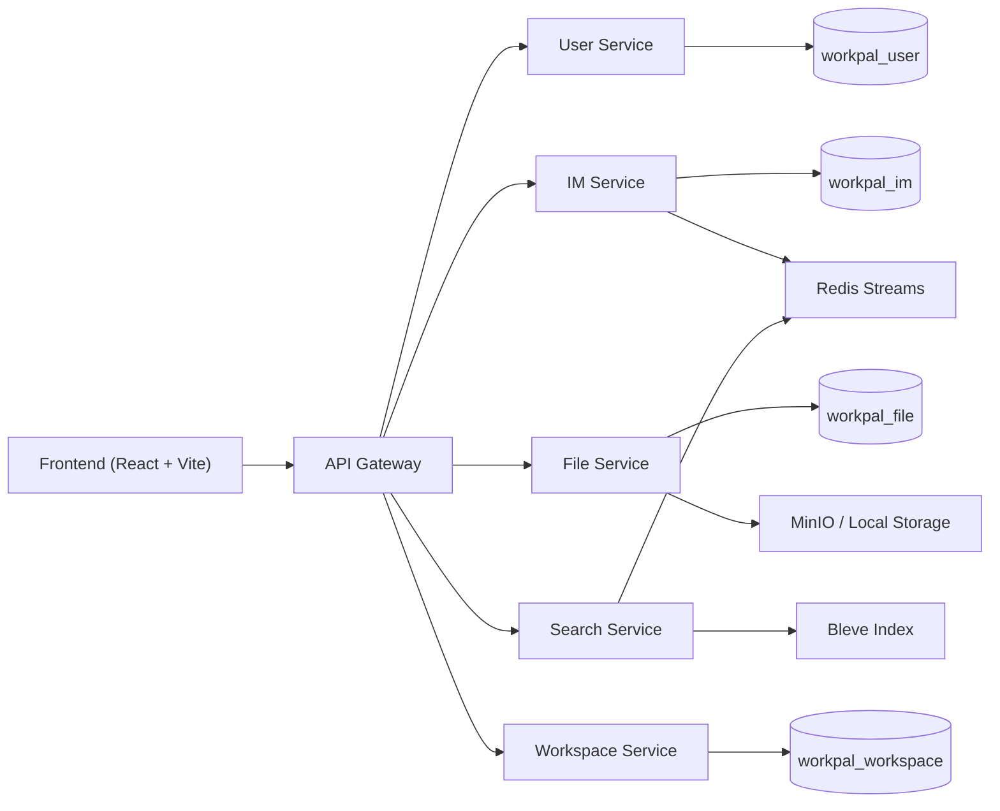
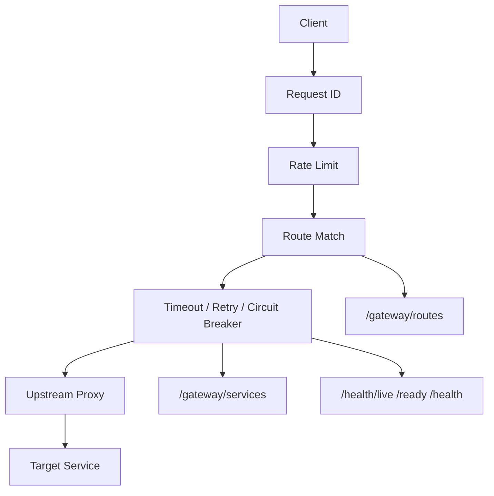
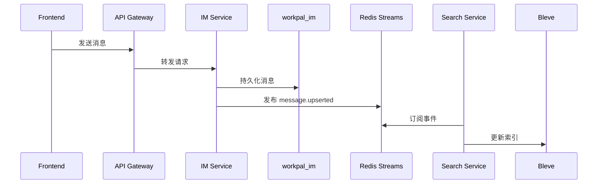

# WorkPal 架构设计

本文档只描述当前仓库已经实现的结构，不描述还没落地的远期设想。

## 1. 设计目标

WorkPal 当前是一个办公协作平台示例项目，覆盖以下核心场景：

- 登录与身份验证
- 通讯录与组织信息
- 私聊与群聊
- 群公告与群文件
- 任务与日程
- 文件上传与分享
- 消息搜索

项目的架构目标有三个：

1. 本地能完整跑通
2. 服务边界足够清楚，适合学习微服务
3. 能体现入口治理、领域拆分、异步解耦这三种关键能力

## 2. 整体拓扑

## 3. 服务划分

### 3.1 API Gateway

Gateway 当前不是简单反向代理，而是一个有治理能力的入口层。

职责包括：

- 前端统一入口
- 路由目录
- 下游服务目录
- 请求 ID 注入
- 限流
- 服务级超时
- 幂等读请求重试
- 熔断器
- 存活、就绪、聚合健康检查

关键管理接口：

| 接口 | 作用 |
| --- | --- |
| `GET /health/live` | 网关进程存活检查 |
| `GET /health/ready` | 网关就绪检查，联动检查下游服务 |
| `GET /health` | 当前默认聚合健康检查 |
| `GET /gateway/routes` | 查看网关路由目录 |
| `GET /gateway/services` | 查看下游服务目录与治理状态 |

路由目录当前覆盖：

| 路径 | 目标服务 |
| --- | --- |
| `/api/v1/auth/*` | User Service |
| `/api/v1/users*` | User Service |
| `/api/v1/departments*` | User Service |
| `/api/v1/conversations*` | IM Service |
| `/api/v1/messages*` | IM Service |
| `/ws` | IM Service |
| `/api/v1/files*` | File Service |
| `/api/v1/conversations/:id/files` | File Service |
| `/api/v1/search*` | Search Service |
| `/api/v1/tasks*` | Workspace Service |
| `/api/v1/schedule*` | Workspace Service |

### 3.2 User Service

职责：

- 登录
- 用户资料
- 部门
- 员工档案
- 开发种子数据

数据库：

- `workpal_user`

核心表：

- `users`
- `departments`
- `employees`

### 3.3 IM Service

职责：

- 私聊
- 群聊
- 消息
- 群公告
- WebSocket
- 对搜索链路发布消息事件

数据库：

- `workpal_im`

核心表：

- `conversations`
- `conversation_members`
- `messages`
- `message_reads`

### 3.4 File Service

职责：

- 个人文件上传、删除、分享
- 群文件上传、列表、删除、分享
- 文件元数据管理

数据库：

- `workpal_file`

核心表：

- `files`

二进制内容存储：

- MinIO
- 或本地文件回退

### 3.5 Search Service

职责：

- 消费消息事件
- 维护 Bleve 索引
- 提供消息搜索接口

核心状态：

- Redis Streams 消费链路
- Bleve 索引文件

它当前不拥有 PostgreSQL 业务数据库。

### 3.6 Workspace Service

职责：

- 任务
- 日程
- 分享次数统计

数据库：

- `workpal_workspace`

核心表：

- `tasks`
- `schedule_events`

## 4. 数据边界

这套后端现在已经不仅是“代码目录拆分”，而是“数据归属也拆分”。

| 服务 | 是否拥有独立数据库 | 原则 |
| --- | --- | --- |
| User Service | 是 | 只由它读写用户、部门、员工数据 |
| IM Service | 是 | 只由它读写会话和消息事实 |
| File Service | 是 | 只由它读写文件元数据 |
| Workspace Service | 是 | 只由它读写任务与日程 |
| Search Service | 否 | 通过事件维护索引，而不是共享主业务库 |

这意味着跨服务协作主要通过两种方式完成：

1. 同步 HTTP 调用
2. 异步消息事件

## 5. Gateway 内部结构

这是当前最值得学习的一层。

### 5.1 路由目录

Gateway 现在用显式的 `routeSpec` 描述路由，而不是把所有规则埋在 `switch` 里。

每条路由携带：

- 名称
- 匹配方式
- 目标服务
- 是否 WebSocket
- 超时策略
- 用途说明

### 5.2 服务目录

Gateway 内部维护显式的 `upstreamService` 列表，并通过 `/gateway/services` 输出：

- 服务名
- 基础地址
- 健康地址
- 超时
- 重试次数
- 是否支持 WebSocket
- 熔断器状态

这相当于一个轻量、静态配置驱动的服务目录。

### 5.3 流量治理

Gateway 当前已经具备三类治理：

#### 限流

- 在入口层按客户端做基础限流
- 健康检查和管理面接口不参与限流

#### 重试

- 只对 `GET / HEAD / OPTIONS` 这类幂等读请求启用
- 写请求不重试
- 重试目标状态码为 `502 / 503 / 504`

#### 熔断

Gateway 为每个下游服务维护一个熔断器，状态有：

- `closed`
- `open`
- `half_open`

它的目标不是“永不失败”，而是：

- 保护下游
- 快速失败
- 在冷却后试探恢复

### 5.4 健康检查

Gateway 把健康检查拆成三个层次：

- `live`：我活着
- `ready`：我和下游都准备好接流量
- `health`：输出当前聚合健康状态

这对容器编排和服务治理来说是更合理的模型。

## 6. 跨服务调用

### 6.1 同步调用

当前已经落地的同步调用：

- File Service -> IM Service
  - 校验用户是否为群成员
- Search Service -> IM Service
  - 获取用户可搜索的会话范围

这样做的目的很明确：

- 把会话权限事实放在 IM Service
- 避免 File / Search 自己维护重复事实

### 6.2 异步调用

当前主要异步链路是消息搜索索引：

收益是：

- 消息写入与搜索索引解耦
- 搜索短时故障不阻塞消息发送
- 学习者可以直观看到事件驱动设计

## 7. 与 Spring Cloud Alibaba 的认知映射

如果你熟悉 Java 微服务，可以这样理解当前 Go 架构：

| Spring Cloud Alibaba 视角 | 当前 Go 实现 |
| --- | --- |
| Spring Cloud Gateway | `backend/cmd/gateway` |
| Nacos（静态化替代） | `backend/configs/*` + `/gateway/services` |
| Sentinel | Gateway 的限流、重试、熔断、健康治理 |
| OpenFeign / 内部调用 | `backend/internal/clients/*` |
| RocketMQ | Redis Streams |

这份映射的价值，在于帮你把当前项目放进一套更成熟的微服务学习框架里。

## 8. 当前架构的优点

### 8.1 边界已经真实存在

不是只分目录，而是：

- 入口分离
- 职责分离
- 数据分离

### 8.2 Gateway 具备教学价值

它现在已经足够展示入口层的关键问题：

- 如何做统一入口
- 如何做路由目录
- 如何做服务目录
- 如何做基础治理

### 8.3 本地仍然能跑

虽然已经是微服务形态，但仍然可以通过一份 Docker Compose 完整启动。

## 9. 当前仍然保留的限制

### 9.1 还不是真正的动态注册中心

当前服务目录依赖静态配置，而不是动态服务注册与实例摘除。

### 9.2 Gateway 还是单实例入口

它已经有治理能力，但还没有扩展到多实例入口协同。

### 9.3 WebSocket 仍是单实例内存 Hub

IM Service 的连接层还没有进入分布式广播阶段。

### 9.4 搜索仍是轻量实现

Bleve 很适合教学和本地运行，但不是大规模生产搜索系统的最终形态。

## 10. 结论

当前 WorkPal 后端已经可以被准确描述为：

> 以 API Gateway 为统一入口、以领域服务为核心、以服务自有数据库为边界、以 Redis Streams 连接异步搜索链路，并在入口层引入基础流量治理与健康管理能力的微服务项目。

它最重要的学习价值，就在于把“入口治理、服务拆分、数据边界、同步调用、异步事件”这几件微服务核心问题放到了同一个仓库里，而且都已经有真实代码可读。
