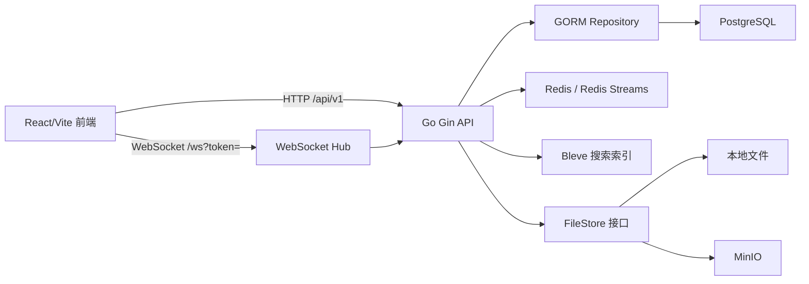

# WorkPal 项目技术特点学习笔记

> 更新时间：2026-04-28  
> 适用范围：本文按当前仓库代码总结，重点帮助学习项目架构、技术选型和关键实现路径。

## 1. 项目定位

WorkPal 是一个办公协作类 Demo，目标不是只做单点功能，而是把企业协作产品常见模块串成一个可运行的全栈样例：

- 登录、当前用户、通讯录、部门数据
- 私聊、群聊、群公告、群文件
- 个人文件上传、下载、分享、删除
- 全文消息搜索
- 工作台总览、任务、日程、文件、通讯录等前端模块
- WebSocket 实时消息推送
- Prometheus 指标与 GitHub Actions CI

当前实现里，聊天、用户、文件、搜索、任务和日程等核心数据都已由后端支撑；前端仍保留少量种子知识卡片用于演示文件模块内容。

## 2. 总体架构



项目已经从单体模块化结构演进为“API Gateway + 领域服务”的微服务形态，同时保留 `cmd/server` 一体化兼容启动方式。这样既能学习服务拆分，也能在本地快速调试。

## 3. 后端技术特点

### 3.1 Gin + GORM 的分层结构

后端按领域划分在 `backend/internal` 下：

- `user`：注册登录、当前用户、用户列表、部门和通讯录。
- `im`：会话、成员、消息、已读水位、WebSocket。
- `file`：文件元数据、上传下载、个人文件和群文件。
- `search`：消息全文索引和搜索。
- `common`：中间件、统一响应、错误、分页。

每个核心领域基本遵循：

```text
handler -> service -> repo -> model
```

学习价值在于职责边界比较清楚：

- `handler` 负责 HTTP 参数、鉴权上下文、响应格式。
- `service` 负责业务规则，例如会话创建、消息发送、文件大小限制。
- `repo` 负责 GORM 查询和持久化。
- `model` 定义数据库结构和 JSON 输出。

### 3.2 统一响应契约

后端响应统一为：

```json
{
  "code": 0,
  "message": "ok",
  "data": {}
}
```

前端 `frontend/src/api/request.ts` 负责统一解包：

- 请求拦截器自动带上 `Authorization: Bearer <token>`。
- 响应解包后，页面代码只处理业务数据。
- 非零 `code` 或 Axios 错误统一转成 `Error`。

这个设计减少了页面里反复判断 `res.data.data` 的混乱，是前后端契约设计的重点。

### 3.3 JWT 鉴权与资源级权限

后端登录后签发 JWT，受保护路由通过 `AuthRequired` 中间件注入 `userID`。项目不仅检查是否登录，还在关键资源上做成员或所有者校验：

- 会话消息历史、发送、已读：必须是会话成员。
- 群成员管理：需要符合群主等业务规则。
- 群文件：需要是对应会话成员。
- 个人文件：只允许上传者访问。
- 消息搜索：限制在当前用户可见的会话范围内。

这类资源级权限是协作系统的核心点，比简单登录态更值得学习。

### 3.4 WebSocket 实时消息链路

当前聊天消息发送采用“HTTP 持久化 + WebSocket 广播”的路径：

```text
前端 POST /conversations/:id/messages
  -> 后端校验会话成员
  -> 消息写入 PostgreSQL
  -> 索引写入 Bleve
  -> WebSocket Hub 推送给会话成员
```

WebSocket 连接地址是：

```text
/ws?token=<jwt>
```

后端解析 token 后，把用户连接注册到 Hub，并加入该用户已有会话。Hub 当前是单进程内存结构：

- `clients`：在线用户到连接的映射。
- `rooms`：会话到连接集合的映射。
- `register/unregister/broadcast`：通过 channel 管理连接生命周期和广播。
- `roomMu/mu`：保护并发访问。

这个实现适合单实例学习和演示。后续多实例部署时，需要引入 Redis Pub/Sub、Redis Streams 或其他消息总线做跨节点广播。

### 3.5 PostgreSQL 数据模型

核心模型包括：

- `users`：账号、昵称、邮箱、手机号、部门、状态。
- `departments`：部门编码、名称、父部门、负责人。
- `employees`：员工编号、职位、办公地点、简介。
- `conversations`：私聊或群聊、群主、公告。
- `conversation_members`：会话成员关系，`conv_id + user_id` 唯一。
- `messages`：消息所属会话、发送人、类型、内容、元数据、回复关系。
- `message_reads`：以 `(user_id, conv_id)` 记录会话级已读水位。
- `files`：文件元数据、对象 key、大小、类型、所属用户和可选会话。

值得注意的是，已读不是每条消息一条记录，而是会话级水位：

```text
message_reads(user_id, conv_id, read_at)
```

未读数可以通过 `messages.created_at > read_at` 计算，适合中小规模场景。

### 3.6 文件存储抽象

文件模块通过 `FileStore` 接口隔离实际存储：

```go
type FileStore interface {
    Upload(ctx context.Context, key string, r io.Reader, size int64, contentType string) error
    Download(ctx context.Context, key string) (io.ReadCloser, error)
    Delete(ctx context.Context, key string) error
    GetURL(ctx context.Context, key string) (string, error)
}
```

当前支持两种实现：

- `LocalFileStore`：开发环境本地目录存储。
- `MinIOFileStore`：对象存储风格，便于将来迁移到 OSS/S3。

业务层不关心底层是本地文件还是对象存储，这是接口抽象的典型应用。

### 3.7 Bleve 搜索

项目使用 Bleve 做嵌入式全文搜索，避免引入 Elasticsearch 这类重型中间件。消息发送后异步写入搜索索引，搜索接口再结合会话权限过滤结果。

这个选型适合学习项目：

- 部署简单，不需要单独搜索集群。
- Go 进程内即可维护索引。
- 后续要升级到 Elasticsearch 或 Meilisearch 时，可以保留 `search` 模块的接口边界。

### 3.8 配置和启动

配置文件位于：

```text
backend/configs/config.example.yaml
```

加载顺序：

1. `CONFIG_PATH`
2. `configs/config.yaml`
3. `configs/config.example.yaml`
4. `backend/configs/config.yaml`
5. `backend/configs/config.example.yaml`

真实 `config.yaml` 不提交，样例配置保留在仓库中，适合本地快速启动和 CI。

## 4. 前端技术特点

### 4.1 React + Vite + Zustand

前端是 Vite 单页应用，核心页面在 `frontend/src/pages`，组件按工作台和聊天模块拆分：

- `WorkspacePage`：工作台容器，负责导航、首屏数据加载、任务/日程/文件等模块状态。
- `ChatPage`：聊天模块页面。
- `components/workspace/*`：总览、任务、日程、文件、通讯录、偏好设置。
- `components/chat/*`：会话列表、聊天窗口、群详情、新建会话。

状态管理使用 Zustand：

- `useAuthStore`：登录态和 token 持久化。
- `useWSStore`：WebSocket 状态与按会话分组的消息。
- `useConvStore`：会话列表和当前会话。
- `usePreferencesStore`：语言、主题、声音、紧凑模式。

### 4.2 API 封装

前端 API 分两层：

```text
request.ts  -> 通用 Axios 实例、鉴权头、响应解包
workpal.ts  -> 具体业务 API
```

这种分层的好处：

- 页面不会直接散落 URL 和响应解包逻辑。
- API 返回类型更容易维护。
- 后端响应结构变化时，优先改 `request.ts` 和 `workpal.ts`。

### 4.3 WebSocket 客户端控制器

聊天相关副作用集中在 `useChatController`：

- 建立 `/ws?token=` 连接。
- 接收 `chat` 消息并转换成前端 `ChatMessage`。
- 断线后 3 秒重连。
- 切换会话时加载历史消息。
- 发送消息走 HTTP API，再由 WS 接收广播。
- 支持消息搜索、群公告、群文件上传和分享。

这比把 WebSocket 逻辑散在组件里更容易维护。

### 4.4 前端状态与后端真实数据并存

当前前端有两类数据：

- 后端真实数据：登录、用户、部门、会话、消息、搜索、文件、任务、日程。
- 前端本地 Demo：文件模块中的部分种子知识卡片。

这个设计让产品体验更完整，同时把需要持久化的工作流收口到后端服务。

## 5. 基础设施与质量保障

### 5.1 Docker Compose

根目录 `docker/docker-compose.yaml` 提供：

- PostgreSQL 16
- Redis 7
- MinIO

每个服务都配置了端口、健康检查和基础资源限制，适合本地开发。

### 5.2 Prometheus 指标

后端暴露 `/metrics`，主要指标包括：

- HTTP 请求数
- HTTP 请求耗时
- WebSocket 在线连接数
- 消息发送总量

这让项目从 Demo 过渡到可观测服务，有助于学习服务运行态分析。

### 5.3 CI

`.github/workflows/ci.yml` 当前包含两个 job：

- 后端：依赖下载、`go build`、`golangci-lint`、`go test -race`。
- 前端：`npm ci`、TypeScript 类型检查、Vitest。

当前只有 CI，没有自动部署。后续如需发布镜像或部署服务器，再接入 CD。

### 5.4 测试资产

项目已有多层测试或测试资产：

- Go 单元测试覆盖用户、会话、消息、文件、搜索、WebSocket race 等模块。
- 前端 Vitest 覆盖请求封装、偏好设置、i18n 等逻辑。
- `testing/e2e/playwright.mjs` 提供端到端 smoke 流程，覆盖登录、会话、群文件、工作台 UI 等。

## 6. 当前技术亮点

1. **模块化单体清晰**：保留简单部署，同时用领域目录和接口抽象避免代码混在一起。
2. **HTTP + WebSocket 职责分离**：HTTP 负责可靠落库，WebSocket 负责实时通知。
3. **资源级权限意识较强**：搜索、文件、会话、消息都围绕用户可见范围做校验。
4. **轻量中间件选择务实**：Redis Streams、Bleve、MinIO/本地双模式都适合学习环境。
5. **前端 API 契约集中**：Axios 解包和业务 API 封装降低页面复杂度。
6. **可观测与 CI 已接入**：不是只写功能，也开始覆盖运行指标和自动检查。
7. **验收账户与种子数据完善**：降低本地体验和 E2E 测试门槛。

## 7. 适合继续学习的扩展方向

### 7.1 深化 Workspace Service

当前任务和日程已经通过 `workspace-service` 持久化。后续可以继续增强：

- 任务评论、附件、截止提醒。
- 日程参与人确认、会议室冲突检测。
- 任务和日程事件接入 Redis Streams。

### 7.2 多实例 WebSocket

当前 Hub 是单进程内存结构。多实例部署可以练习：

- Redis Pub/Sub 广播在线消息。
- Redis Streams 做可靠事件流。
- 在线状态从进程内存迁移到 Redis。

### 7.3 搜索能力增强

可以逐步加入：

- 文件名和用户搜索。
- 搜索结果高亮。
- 中文分词优化。
- 从 Bleve 替换到 Meilisearch 或 Elasticsearch。

### 7.4 文件服务增强

可以继续扩展：

- MinIO bucket 自动创建。
- 下载签名 URL。
- 文件权限分享范围。
- 文件预览和缩略图。

### 7.5 云文档协作

文档里已经将 Yjs/CRDT 作为优先方向。可以从最小版本开始：

- 前端集成 Yjs + 编辑器。
- 后端提供文档房间鉴权。
- 增量同步和快照持久化。

## 8. 阅读代码建议

推荐按这个顺序阅读：

1. `README.md`：先理解启动流程和功能边界。
2. `backend/cmd/server/main.go`：看依赖初始化、路由注册、指标、自动迁移。
3. `backend/internal/user`：学习登录、JWT、用户目录。
4. `backend/internal/im`：学习会话、消息、已读、WebSocket。
5. `backend/internal/file`：学习文件接口抽象和权限。
6. `backend/internal/search`：学习轻量全文搜索。
7. `frontend/src/api/request.ts` 与 `frontend/src/api/workpal.ts`：理解前端 API 契约。
8. `frontend/src/hooks/useChatController.ts`：理解聊天实时链路。
9. `.github/workflows/ci.yml`：理解自动检查流程。

## 9. 一句话总结

WorkPal 的技术特点是：用较轻的技术栈实现一个完整办公协作产品的主要骨架，后端强调模块化、权限、实时消息、文件和搜索抽象，前端强调工作台体验、状态管理和 API 契约，整体非常适合作为 Go + React 全栈协作系统学习项目。
